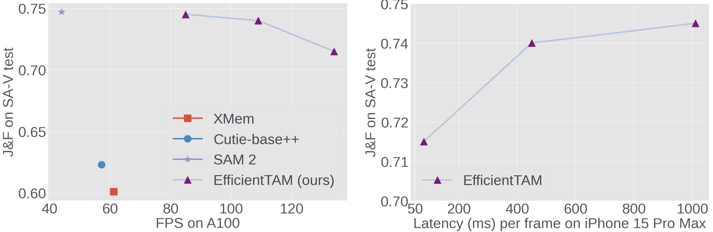

# Efficient Track Anything
[[`📕Project`](https://yformer.github.io/efficient-track-anything/)][[`🤗Gradio Demo`](https://bea2c478296e25b3ce.gradio.live)][[`📕Paper`](https://arxiv.org/pdf/2411.18933)][[`🤗Checkpoints`]](https://huggingface.co/yunyangx/efficient-track-anything/tree/main)



The **Efficient Track Anything Model(EfficientTAM)** takes a vanilla lightweight ViT image encoder. An efficient memory cross-attention is proposed to further improve the efficiency. Our EfficientTAMs are trained on SA-1B (image) and SA-V (video) datasets. EfficientTAM achieves comparable performance with SAM 2 with improved efficiency. Our EfficientTAM can run **>10 frames per second** with reasonable video segmentation performance on **iPhone 15**. Try our demo with a family of EfficientTAMs at [[`🤗Gradio Demo`](https://bea2c478296e25b3ce.gradio.live)].


## News
[Dec.22 2024] We release [`🤗Efficient Track Anything Checkpoints`](https://huggingface.co/yunyangx/efficient-track-anything/tree/main).

[Dec.4 2024] [`🤗Efficient Track Anything for segment everything`](https://5239f8e221db7ee8a0.gradio.live/). Thanks to @SkalskiP!

[Dec.2 2024] We release the codebase of Efficient Track Anything.

## Online Demo & Examples
Online demo and examples can be found in the [project page](https://yformer.github.io/efficient-track-anything/).

## EfficientTAM Video Segmentation Examples
  |   |   |
:-------------------------:|:-------------------------:
SAM 2 | 
EfficientTAM |  

## EfficientTAM Image Segmentation Examples
Input Image, SAM, EficientSAM, SAM 2, EfficientTAM
  |   |   |
:-------------------------:|:-------------------------:
Point-prompt | 
Box-prompt |  
Segment everything |

## Model
EfficientTAM checkpoints are available at the [Hugging Face Space](https://huggingface.co/yunyangx/efficient-track-anything/tree/main).

## License
Efficient track anything checkpoints and codebase are licensed under [Apache 2.0](./LICENSE).

## Acknowledgement

+ [SAM2](https://github.com/facebookresearch/sam2)
+ [SAM2-Video-Predictor](https://huggingface.co/spaces/fffiloni/SAM2-Video-Predictor)
+ [florence-sam](https://huggingface.co/spaces/SkalskiP/florence-sam)
+ [SAM](https://github.com/facebookresearch/segment-anything)
+ [EfficientSAM](https://github.com/yformer/EfficientSAM)

If you're using Efficient Track Anything in your research or applications, please cite using this BibTeX:
```bibtex


@article{xiong2024efficienttam,
  title={Efficient Track Anything},
  author={Yunyang Xiong, Chong Zhou, Xiaoyu Xiang, Lemeng Wu, Chenchen Zhu, Zechun Liu, Saksham Suri, Balakrishnan Varadarajan, Ramya Akula, Forrest Iandola, Raghuraman Krishnamoorthi, Bilge Soran, Vikas Chandra},
  journal={preprint arXiv:2411.18933},
  year={2024}
}
```
